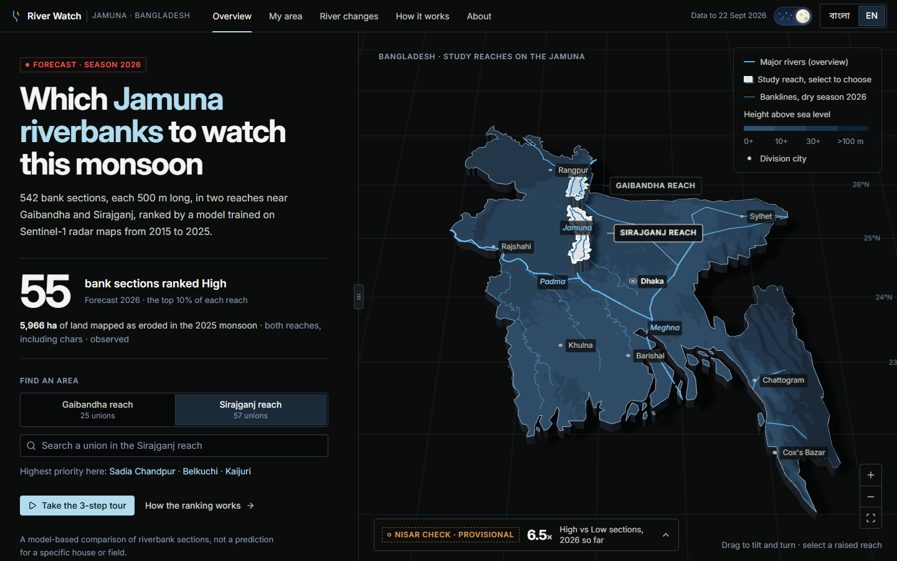
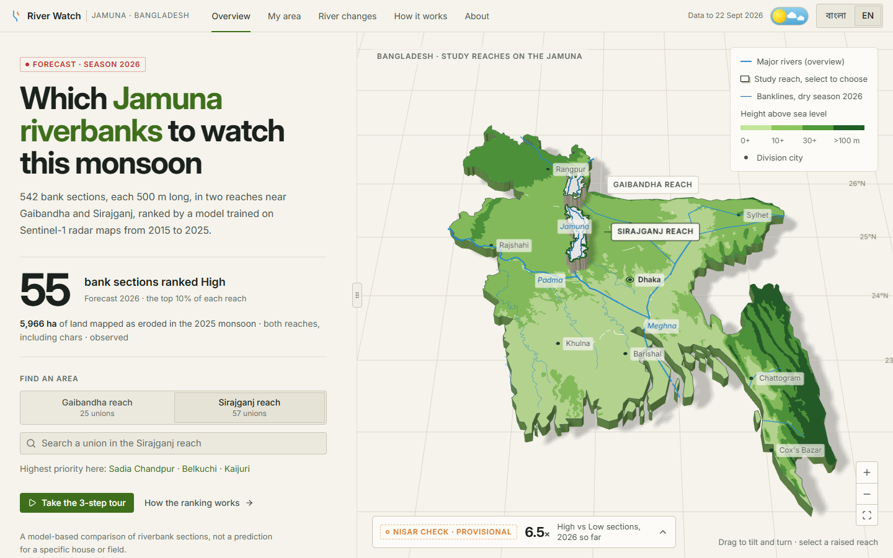
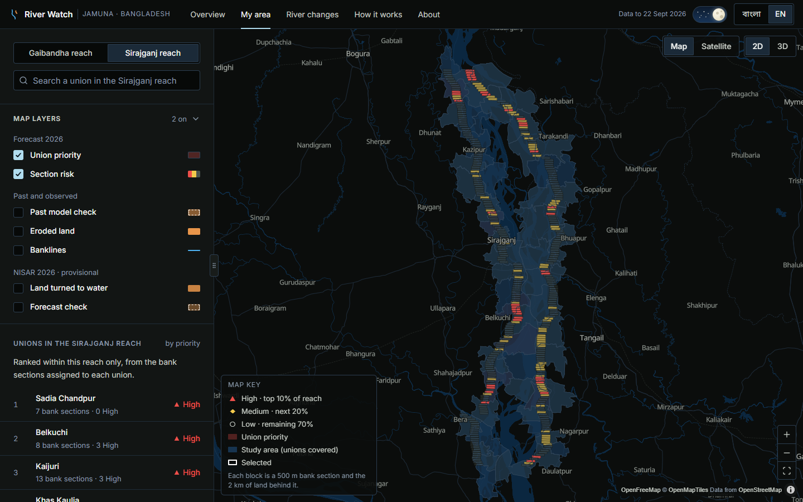
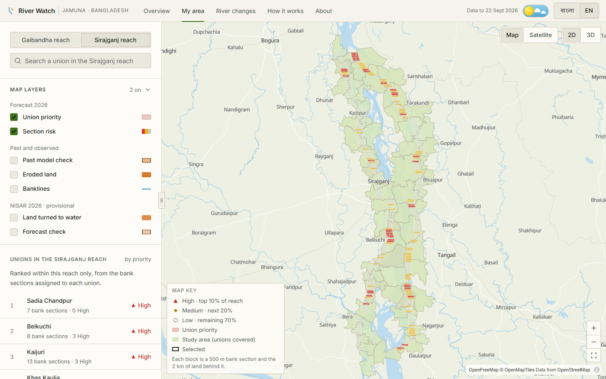
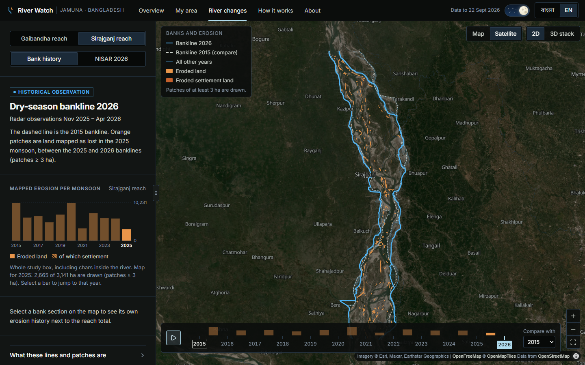
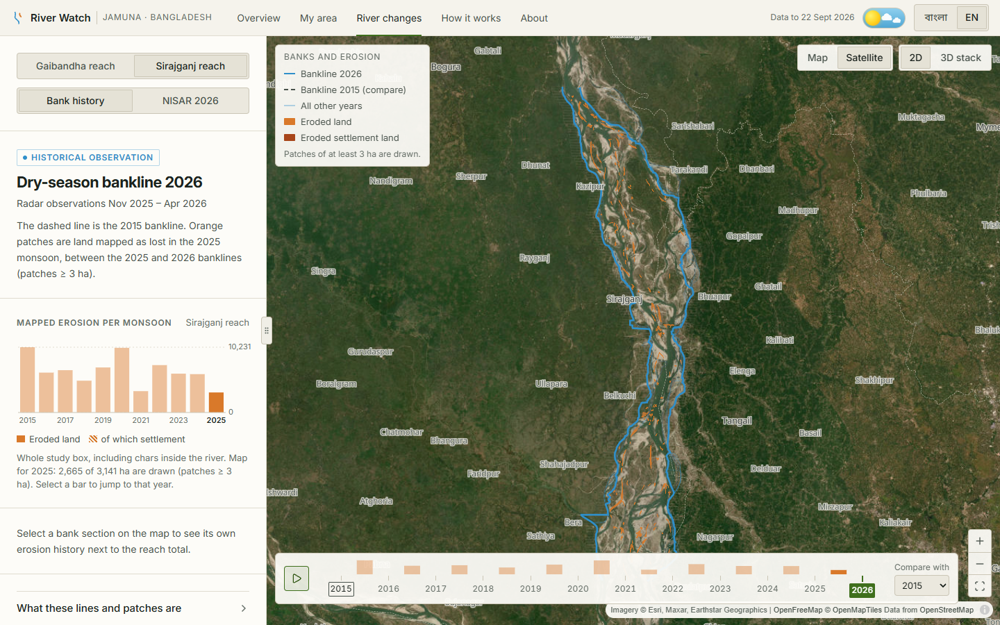
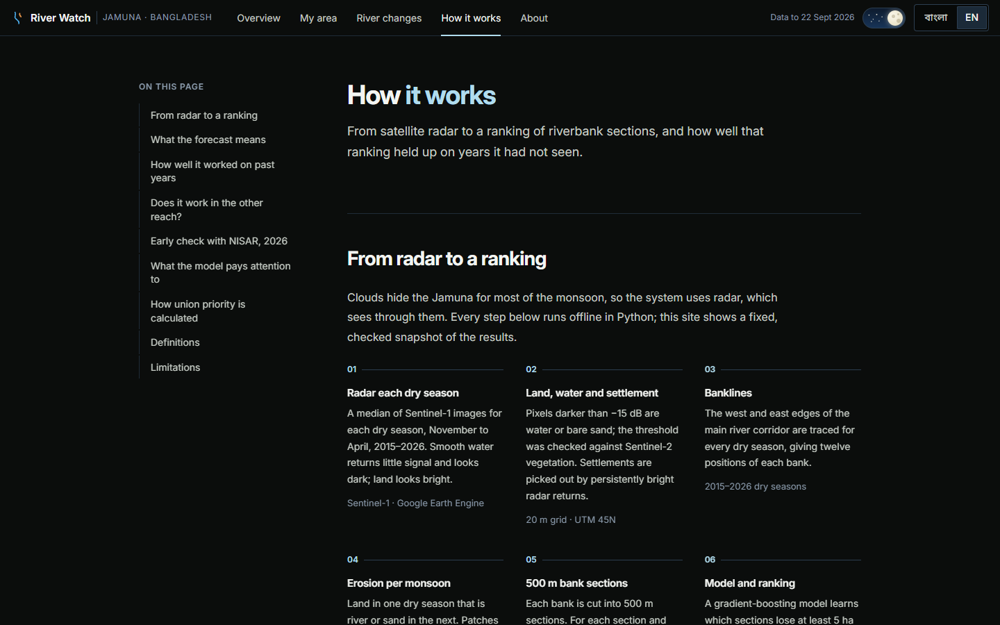
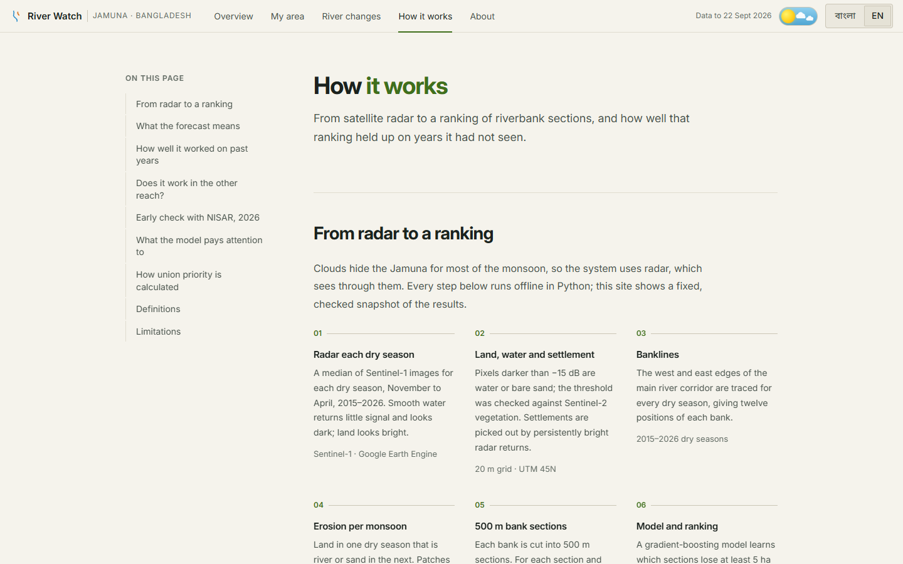
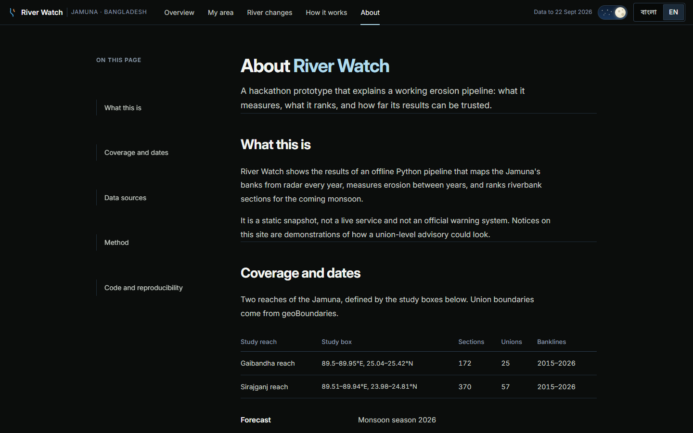
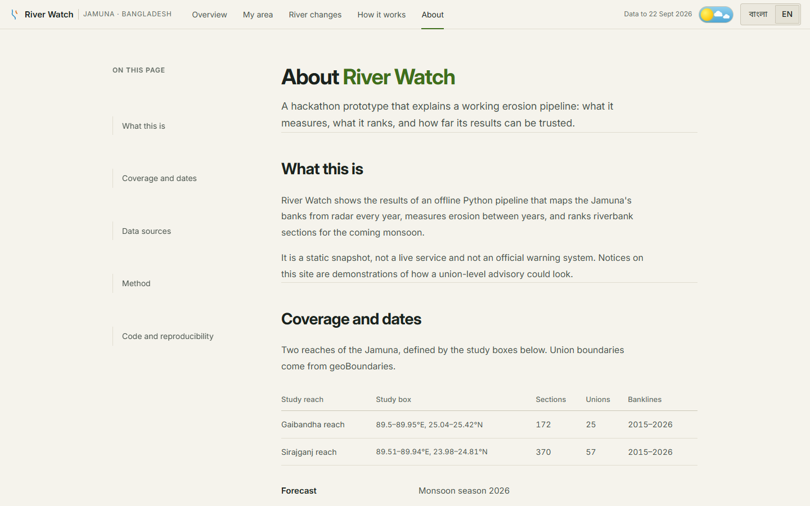

# River Watch — Char Erosion Watch

**NASA Space Apps Challenge 2026 · Dancing with the SARs**

River Watch ranks riverbank sections of the Jamuna in Bangladesh by how likely they are to lose land in the coming monsoon, using radar satellites that see through monsoon cloud. It covers two reaches — near **Gaibandha** and near **Sirajganj** — split into **542 bank sections** of 500 m each, across **82 unions**.

- **Pipeline (Python):** maps the river every dry season from Sentinel-1 radar (2015–2026), measures land lost in each monsoon, builds features per bank section, trains a model and ranks sections for the 2026 monsoon.
- **Check (NISAR):** NASA–ISRO NISAR L-band passes from June–September 2026 give an early, provisional test of that forecast on a year and a sensor the model never saw.
- **Website (React):** a bilingual (Bangla / English) site that explains the results, with 3D and 2D maps, light and dark themes.



> A model-based comparison of riverbank sections, **not** a prediction for a specific house or field. High / Medium / Low are relative ranks within each reach, not probabilities, and Low does not mean safe.

---

**Contents:** [Results](#results-at-a-glance) · [Screenshots](#screenshots) · [Repository layout](#repository-layout) · [Quick start](#quick-start) · [The website](#the-website) · [Deploying](#deploying-to-vercel) · [Data sources](#data-sources) · [Limitations](#limitations)

---

## Results at a glance

| | |
|---|---|
| Hindcast (trained on monsoons ≤ 2022, tested on 2023–2025) | Flagging the riskiest 20% of sections caught **50%** of major-erosion events; repeating last year's erosion caught 42%, a random pick 19%. PR-AUC 0.282 vs 0.272 for persistence. |
| NISAR 2026 check (provisional, passes to 22 Sep 2026) | Sections ranked **High** saw major erosion **27%** of the time so far, against **4%** for Low (≈ 6.5×). Persistence still has higher recall this year. |
| Forecast | 55 sections ranked High (top 10% per reach) for the 2026 monsoon. |

Full tables and caveats are on the site's **How it works** page and in `docs/`.

---

## Screenshots

Every page has a dark (default) and a light theme.

| Dark | Light |
|---|---|
|  |  |
|  |  |
|  |  |
|  |  |
|  |  |

---

## Repository layout

```text
00_region_bbox.py … 10_nisar_check.py   Pipeline steps (see run.txt and docs/step_*.md)
config.py                               Study regions, thresholds, paths
data/                                   Inputs needed to retrain (most outputs are git-ignored)
docs/                                   Step-by-step notes, REPRODUCE.md, PROGRESS.md
scripts/prepare_frontend_data.py        Builds the website's data bundle from pipeline outputs
frontend/                               The React website (Vite, JSX only)
web/dashboard.html                      Original single-file Leaflet dashboard (kept as a fallback)
run.txt                                 Plain step-by-step run guide (Windows cmd)
```

---

## Quick start

### 1. Rebuild the results (≈ 3 minutes, no Earth Engine needed)

Python 3.13–3.14. The pinned versions in `requirements-lock.txt` reproduce the documented numbers exactly.

```bat
py -3.14 -m venv nenv
nenv\Scripts\activate          :: macOS/Linux: source nenv/bin/activate
pip install -r requirements-lock.txt
python 05_model.py
python 06_threat_score.py
python 10_nisar_check.py
```

Re-running the satellite steps (01–04, 08–09) needs Google Earth Engine and a NASA Earthdata account — see `run.txt` and `docs/REPRODUCE.md`.

### 2. Prepare the website data

```bash
python scripts/prepare_frontend_data.py
```

Writes a validated bundle to `frontend/public/data/` (≈ 17 MB). It also downloads, once, the public context layers it needs into `data/context/`: geoBoundaries outlines, Natural Earth rivers and AWS Terrain Tiles elevation. Everything is written to a temporary folder, checked, then swapped in — a failed run leaves the previous bundle untouched.

River summaries and photos for the overview map come from Wikipedia / Wikimedia Commons and are stored in `frontend/public/content/rivers.json`. Refresh them with:

```bash
node frontend/scripts/fetch-river-info.mjs
```

### 3. Run the website

Node 22.

```bash
cd frontend
npm install
npm run dev
```

Open http://localhost:5173. Add `?lang=en` or `?lang=bn` to a link to choose the language.

```bash
npm run build      # validates the data bundle, then builds to frontend/dist
npm run preview    # serves the production build locally
```

---

## The website

| Page | Route | What it answers |
|---|---|---|
| Overview | `/` | Where the study reaches are (3D map of Bangladesh), the headline forecast, a 3-step guided tour |
| My area | `/my-area` | A union's priority, its bank sections, people nearby, the advisory notice; map layers for past checks, erosion, banklines and NISAR |
| River changes | `/river-changes` | Banklines year by year (2015–2026) with play/compare, erosion per monsoon, a 3D time stack; NISAR 2026 tab |
| How it works | `/how-it-works` | Method, evaluation against baselines, feature importance, definitions, limitations |
| About | `/about` | Coverage, dates, data sources and credits |
| River | `/river/:id` | One of the ten major rivers on the overview, zoomed on the map with its summary |

**Stack:** React 19 (JSX), Vite, React Router, TanStack Query, react-i18next, MapLibre GL (keyless OpenFreeMap vector tiles and Esri imagery), three.js for the 3D overview, Inter and Noto Sans Bengali.

**Colour rules** — every hue has one meaning, in both themes:

| Role | Light theme | Dark theme |
|---|---|---|
| Interactive / selected | forest green | powder blue |
| Water, rivers, banklines | sky blue | azure |
| Relative risk High / Medium / Low | red / yellow / grey | red / yellow / grey |
| Observed land loss | amber | amber |
| Overview height tint (low → high) | pale → deep green | steel → Prussian blue |

### Deploying to Vercel

Create a project from this repository with **Root Directory `frontend`** and the **Vite** preset (build `npm run build`, output `dist`). `frontend/vercel.json` rewrites the page routes to the app. The data bundle is committed, so the deployed site needs no server, Python or API keys.

---

## Data sources

Copernicus Sentinel-1 and Sentinel-2 (ESA, via Google Earth Engine) · NISAR L2 GCOV, provisional (NASA/ISRO, via ASF DAAC) · JRC Global Surface Water · Dynamic World · MERIT Hydro · Google Open Buildings v3 · WorldPop 2020 · geoBoundaries · Natural Earth · AWS Terrain Tiles · OpenFreeMap / OpenMapTiles / OpenStreetMap · Esri World Imagery · Wikipedia and Wikimedia Commons (river summaries and photos, CC BY-SA).

Method follows Freihardt & Frey (2023), *Natural Hazards and Earth System Sciences* 23, 751–770.

## Limitations

- Eleven monsoons of history; a rare extreme year may behave unlike any of them.
- Ranks are relative within each reach. Population (WorldPop 2020) and buildings are exposure context, not counts of losses.
- Settlements are inferred from radar brightness.
- NISAR results stay provisional until the falling-river passes of October–November 2026 are processed.
- Only two reaches of the Jamuna are covered, not whole districts.
- Bangla wording on the website still needs review by a fluent speaker.
